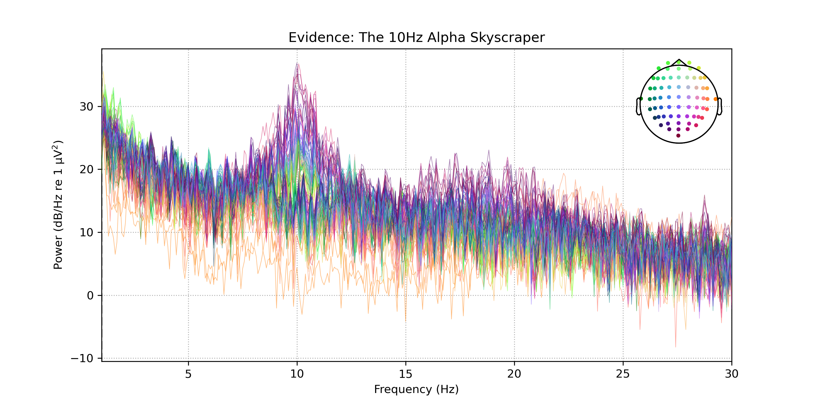
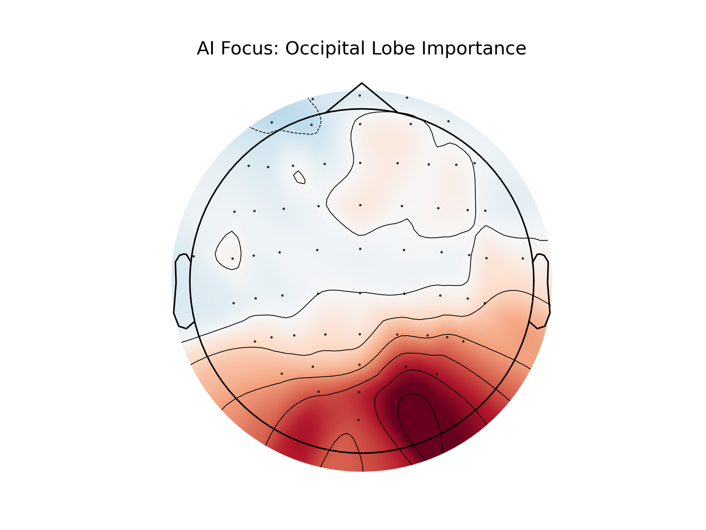

# EEG Classification of Alpha-Band Oscillations

**Result:** Built a machine learning model that classifies eyes-open vs eyes-closed brain states using EEG alpha-band (≈10Hz) activity.

---

## Overview

This project builds a full machine learning pipeline using 64-channel EEG data to classify cognitive state (eyes open vs eyes closed). It uses frequency-domain analysis to detect alpha-band neural oscillations associated with the Berger effect.

The model demonstrates how brain-state differences can be captured using simple and interpretable machine learning methods.

---

## Key Result
- Classification Accuracy: 100% (dataset-specific EEG recording)
- Model: Logistic Regression (scikit-learn)
- Signal Processing: MNE-Python

> Note: Results are specific to the dataset used and may not generalize across all EEG recordings.

---

## Methodology

### EEG Preprocessing
- Loaded 64-channel EEG dataset
- Applied bandpass filtering to isolate neural frequency bands
- Segmented data into eyes-open vs eyes-closed conditions

---

### Feature Extraction
- Computed Power Spectral Density (PSD)
- Extracted alpha-band (~10Hz) activity
- Converted EEG signals into frequency-domain feature vectors

---

### Classification Model
- StandardScaler for normalization
- Logistic Regression classifier (scikit-learn)
- Trained on EEG spectral features

---

## Key Findings

### Alpha-band Separation (10Hz Activity)
A strong power increase at ~10Hz is observed during the eyes-closed condition, consistent with established neuroscience findings.



---

### Spatial Interpretability (Occipital Cortex Activity)
Model feature weights mapped onto scalp regions show strongest influence in the occipital cortex, aligning with known visual processing areas in the brain.



---

## Tech Stack
- Python
- MNE-Python (EEG signal processing)
- Scikit-learn (Machine Learning)
- NumPy / Pandas
- Matplotlib

---

## How to Run

Install dependencies:
```bash
pip install -r requirements.txt
